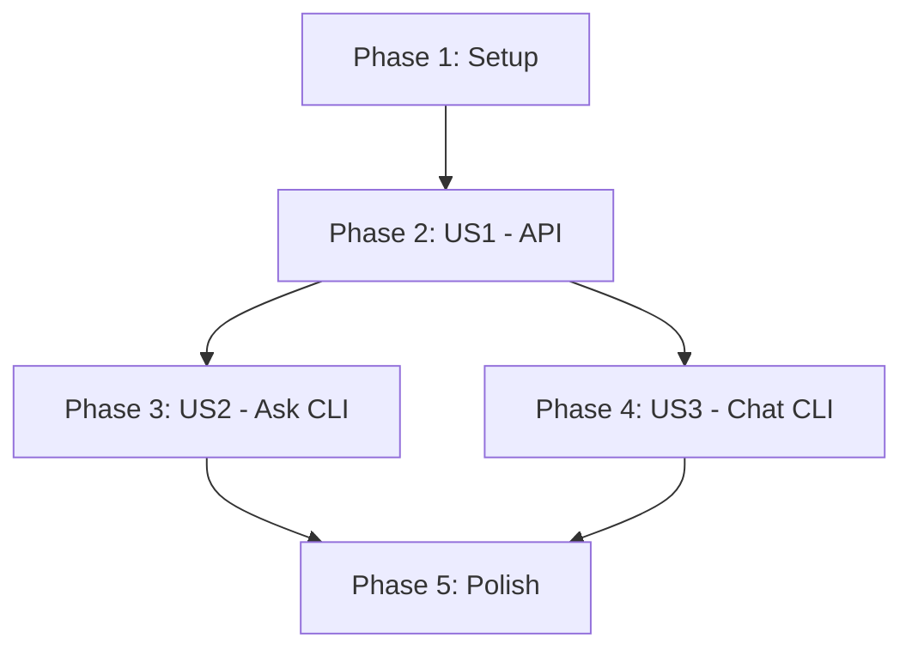

# Task Plan: API & CLI Chatbot

**Note for the LLM**: When implementing tasks involving the nuclia sdk, if you are not 100% certain about APIs, properties, types, or other logic, please consult the official Nuclia developer documentation to ensure accuracy. The links are provided in the [readme](../../readme.md)

**Branch**: `001-api-cli-chatbot` | **Date**: November 7, 2025 | **Spec**: [./spec.md](./spec.md)

## Phase 1: Setup

- [X] T001 Install project dependencies in `requirements.txt`
- [X] T002 Create `api.py` for the FastAPI application
- [X] T003 Create `cli.py` for the Click CLI application
- [X] T004 Create `tests/test_api.py` for API tests
- [X] T005 Create `tests/test_cli.py` for CLI tests

## Phase 2: User Story 1 - API Endpoint

**Goal**: Implement the `/search` API endpoint.
**Independent Test**: Send requests to the endpoint and verify correct JSON responses and error handling.

- [X] T006 [US1] Define Pydantic models for `SearchQuery` and `SearchResult` in `api.py`
- [X] T007 [US1] Implement the `/search` endpoint in `api.py`
- [X] T008 [US1] Write a test for a successful search request in `tests/test_api.py`
- [X] T009 [US1] Write a test for handling invalid `search_type` in `tests/test_api.py`

## Phase 3: User Story 2 - Simple CLI Query

**Goal**: Implement the `ask` command in the CLI.
**Independent Test**: Run `python cli.py ask "<question>"` and verify the top 3 results are printed.

- [X] T010 [US2] Implement the `ask` command in `cli.py`
- [X] T011 [US2] Write a test for the `ask` command in `tests/test_cli.py`

## Phase 4: User Story 3 - Interactive CLI Chat

**Goal**: Implement the `chat` command for an interactive session.
**Independent Test**: Run `python cli.py chat`, ask multiple questions, and type `exit` to end the session.

- [X] T012 [US3] Implement the `chat` command in `cli.py`
- [X] T013 [US3] Write a test for the `chat` command's interactive loop in `tests/test_cli.py`

## Phase 5: Polish & Cross-Cutting Concerns

- [X] T014 Update `main.py` to integrate and call the new CLI commands from `cli.py`
- [ ] T015 Update `readme.md` with the setup and usage instructions from `quickstart.md`

## Dependencies

- **User Story 1** is a prerequisite for User Stories 2 and 3, as the CLI will call the API.
- **User Story 2** and **User Story 3** can be implemented in parallel after User Story 1 is complete.

## Parallel Execution

- **Within US1**: T008 and T009 can be worked on in parallel.
- **Across Stories**: Once US1 is complete, US2 (T010, T011) and US3 (T012, T013) can be developed in parallel.

## Implementation Strategy

The implementation will follow an MVP-first approach. The initial focus will be on delivering User Story 1, which provides the core API functionality. This enables immediate integration and testing. Subsequent user stories, which build on the API, will be delivered as independent increments. This ensures that a valuable, testable piece of functionality is delivered at each stage.
